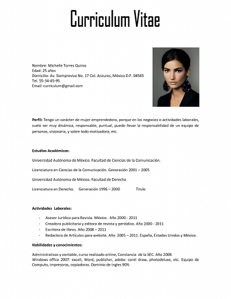
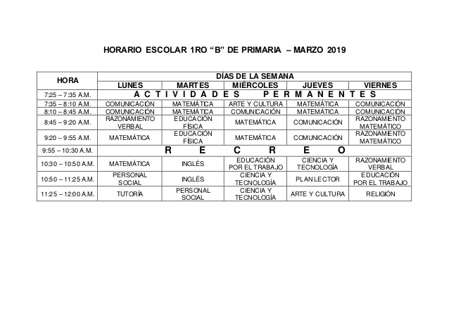
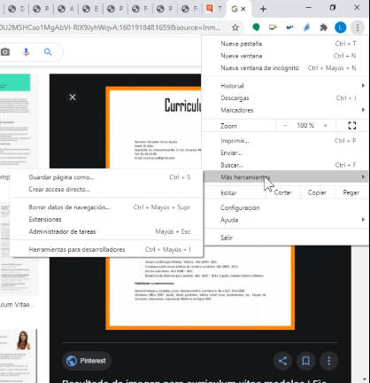

# Práctica de XML, JSON y Yaml

Tienes que hacer el modelado en uno de estos lenguajes (XML, JSON y Yaml) de tres elementos que se indican.

> No hace falta en ninguno de los casos que llegues hasta el final (por ejemplo, si un curriculum tiene un listado de cursos, con que indiques uno o dos para ver cómo lo modelas, es suficiente). Tampoco hace falta que cubras todas las secciones. La idea es hacerte pensar sobre cómo lo modelarías en estos lenguajes de intercambio de datos.

## Curriculum

Vale cualquier currículum, no hace falta que sea el de la imagen, pero se sugiere este.

## Calendario

Vale cualquier calendario. Puedes tomar este como muestra.

## Menú de Chorme

Aquí simplemente abre Chrome y mira el menú que ofrece en la parte de la derecha. 

Para que sepas qué menú, te dejamos la siguiente imagen.

